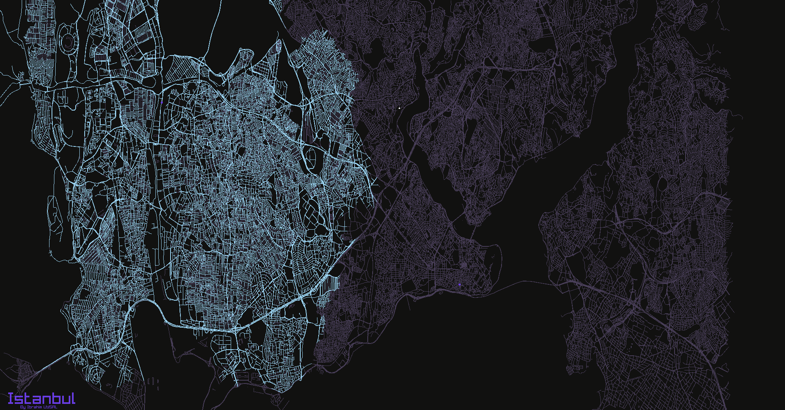
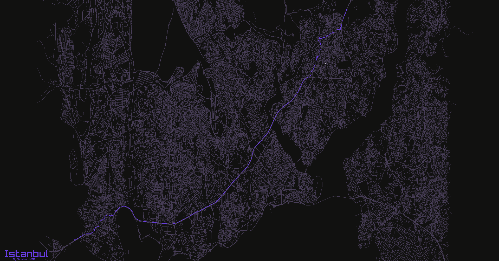

**gezgin is a simple pathfinding visualizer application**

Explore Istanbul's streets visually with gezgin, our pathfinding tool. Made using C++ and raylib, Gezgin helps you see different routes through the city. Easy to use and visually engaging, it's a great way to navigate Istanbul's roads.

gezgin highly inspired by a YouTube video from [Navigraphix](https://www.youtube.com/watch?v=IsWjc158MMo)

---

<br>
<br>


features
--------
  - Istanbul roads visualization
  - Cross-platform
  - Overpass API OSM Json parsing
  - Geospatial indexing
  - Geospatial standartization and scaling
  - Dijkstra pathfinding
  - Adjacency list for data structure
  - 60 FPS 300k node/way rendering (RenderTexture)

usage
-----
<video controls src="./docs/gezgin.mp4" title="Gezgin"></video>





build
-----
gezgin is a cross-platform tool, allowing compilation for Linux, Windows, and macOS. To compile gezgin, you'll need CMake, make, raylib, and gcc installed on your system. gezgin also offers automated dependency installation, simplifying the setup process for users.


1. Create build folder
```bash
mkdir build
```

2. Navigate to the build folder
```bash
cd build
```

3. CMake
```bash
cmake .. -G "Unix Makefiles"
```

4. Compile gezgin
```bash
make
```

5. Run binary file
```bash
./gezgin.exe
```

afterword
---------
I developed this application before i graduated from university. It might have some structural problem, after all i am a newbie graphic lover. When i started this project, i thought it would be easier. But my inexperience comes from here, it didn't happen that way.
Geohash and conversion of latitude and longitude into the Cartesian system are things I've learned.

I used a data structure that effectively holds more than 300k nodes. At first I considered a neighborhood matrix, but when I realized it required 77GB of ram I had to look for other methods.

Generating more than 600k rows in each frame reduced the FPS to 15. I fixed it to 60 fps by drawing the paths in RenderTexture2D. Thanks to the raylib subreddit for this help.

Raylib is really a great tool. I love working with it and will continue to do so.